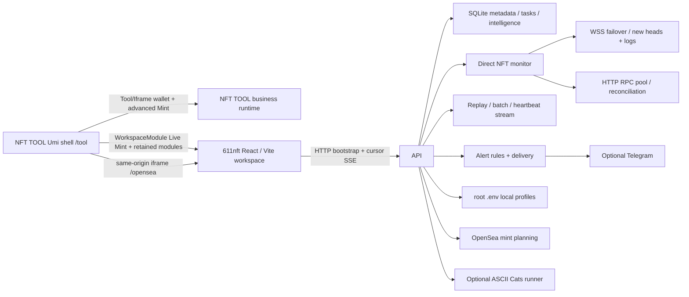

# 611nft 2.0 设计与安全说明

## 目标

611nft 2.0 将原双链 Vanilla/eRPC Mint 面板升级为 React + Express 的七链本地工作台，同时保持三个原则：真实链上数据、私钥只留在本地服务端、任何资产写入必须在服务端二次确认。

## 架构

- `apps/nfttool/`：Umi/Ant Design 平台、菜单、611nft 品牌、NFT TOOL iframe 装载层和本地模块边界。
- `apps/nfttool/src/pages/Tool/Iframe/`：钱包与高级 Mint 的 NFT TOOL 原始 URL 协议和 iframe 外壳。
- `apps/nfttool/src/workspace/`：跟单、报警、数据视图和自研 NFT Live Mint 等 611nft 保留模块源码。
- `src/`：指向 `apps/nfttool/src/workspace/` 的兼容入口，保留既有 Vite、测试和工具路径。
- `server/index.js`：API、SQLite、本地签名、Preview/Confirm 状态机。
- `server/wallet-provider.js`：逐行私钥 profile 解析、生成和账户加载。
- `server/mint-monitor.js`：链上日志扫描、供应量、Mint 价格、媒体与 lifetime minters。
- `server/rpc-pool.js`：公共读池的 WSS/HTTP 多端点切换、hedging、短期缓存、inflight 合并、429 退避、熔断和链 ID 校验；它不保存交易页的写 profile。
- `server/rpc-profiles.js`：服务端写 profile 解析、内置独立多 endpoint 健康池、链 ID 校验、脱敏元数据和只读测试（`eth_chainId`/`eth_blockNumber`）。公开 profile 固定为 Ethereum/BSC/Base/Robinhood/自定义五项；内置 profile 无需额外环境变量即可使用，`NFT_WRITE_RPC_*` 仅用于覆盖对应候选池。Main 仅作旧任务内部兼容，HK 仅兼容解析为 Ethereum，Flashbots/Arbitrum/ZKS/Shib 写 profile 退役。自定义 endpoint 只保存在短期内存 `profileRef`；Follow Mint 规则表只保存稳定 profile ID，引用留在当前进程。发送节点决定交易链；Live Mint 切换发送节点时重建该链的 bootstrap、SSE 和公共读池状态，实际读取仍走公共读 endpoint。
- `server/realtime-stream.js`：每链 cursor、ring buffer、同合集批次、心跳速率、patch 和回撤传输。
- `server/mint-trending.js`、`server/deployer-profile-store.js`、`server/collection-flags.js`、`server/seadrop-radar.js`：本地情报与风险状态。
- `server/alert-service.js`、`server/notifier.js`：持久化报警规则、SSE 投递和可选 Telegram 通知。
- `ascii-cats-mint/`：固定 Robinhood ASCII Cats 流程的独立 fail-closed runner。

## 平台与模块边界

Express 在生产构建中分别托管 `/tool/*` 的 Umi 平台和 `/opensea/*` 的本地 React 工作区，根路径跳转到 `/tool/walletManager/walletManager`。钱包管理、分发、归集、多对多、交易所充值和高级 Mint 原始页面由 `Tool/Iframe` 加载；`/mint` 等明确保留页面使用 611nft `WorkspaceModule`。

平台采用无账号会话模型：启动不读取用户信息，不发起钱包签名登录，不注入用户 token，也不按会员、PASS 或管理员状态拦截页面。钱包连接是链上交互能力，不是进入平台或加载模块的条件。

NFT TOOL 的 `Tool/Iframe` 直接构造 `${iframeDomain}/${name}?thekkkey=12`，不经过 611nft runtime 探测 API，也不注入旧账号 token。原始压缩包只提供该外壳，没有 iframe 内部业务应用源码；开发配置指向 `localhost:8081`，生产配置指向独立 NFT TOOL 运行时。611nft 的 Umi 与 Vite React 运行时继续隔离，Vite 通过 `resolve.dedupe` 固定 React/ReactDOM。

NFT Live Mint、项目名称和项目 Logo 继续由 611nft 的 monitor、媒体代理和本地 React 组件提供；源码归一化不改变真实数据优先级、SSE 协议或图片缓存策略。

## 数据与信任边界

高价值资产：根 `.env` 私钥材料、confirmation token、认证读/写 RPC/WSS URL、远程 API token、Telegram bot token/chat ID、待广播交易。

受信任：运行主机、项目根 `.env`、显式配置的 RPC。

不受信任：浏览器请求、合集/provider 数据、RPC/WSS 响应、NFT metadata、OpenSea 交易计划、Blockscout、SeaDrop 日志、Telegram 响应、代理 API 和 runner ticket。

SQLite 保存钱包 profile ID/地址、标签、余额、任务、交易摘要、minter 游标，以及情报表 `deployer_profiles`、`collection_flags`、`seadrop_drop_logs`/`seadrop_drops`/`seadrop_checkpoints`、`alert_rules`/`alert_deliveries`。它不保存私钥、助记词、Telegram token 或认证 RPC URL。私钥仅从权限为 `600` 的根 `.env` 读取，不进入 API 响应。

## Mint 监控与供应量

监控器从 ERC-721/ERC-1155 的零地址 Transfer 建立活动集合，读取链上 `totalSupply()` 作为当前供应量的权威值，并尝试 `maxSupply`、`MAX_SUPPLY`、`collectionSize` 作为上限。临时读取失败时，只在已有快照上增加本批事件数量，并封顶已知最大供应量。

provider 仅作为补充；本地链上状态优先。首次无法读取供应量时显示未知，不以事件计数伪装权威总供应量。

## 实时采集与下行协议

每链 WSS manager 按 `WSS_RPC_URL_<CHAIN_KEY>`、`WSS_RPC_URLS_<CHAIN_KEY>` 顺序连接，订阅新区块、零地址 Transfer 和 SeaDrop 阶段更新；连接错误时轮换端点并记录延迟、命中、HTTP fallback、429 和最近错误。WSS 事件用于立即唤醒监控扫描，HTTP `*_RPC_URL(S)` 继续执行连续区块 `eth_getLogs`，因此断线期间仍能轮询，恢复后也以 HTTP 区间扫描补洞。NFT removed 日志转为 `discard`，SeaDrop removed 日志回算对应阶段。

浏览器不直接连接上游 WSS。Express 通过 SSE 向每链分配单调 `chainId-sequence` cursor，并把有 cursor 的事件保存在固定 ring buffer。`Last-Event-ID` 位于缓冲范围内时严格补发其后的事件；非法、跨链、超前或已淘汰的 cursor 产生 `replay_reset`，由客户端重新请求 `/api/bootstrap`。replay 期间的新事件先进入 subscriber pending 队列，避免补发与实时流之间出现缝隙。

原始 `mint` 先按链和合约在短窗口聚合为 `mint_batch`，保留原事件 ID、总数量和 token ID 范围。`collection_update` 规范为 `collection_patch`，`discard` 同步删除待发送批次和客户端记录。每秒 heartbeat 携带 60 秒 `mintRateSamples`、窗口 Mint 总量和最新 monitor status；heartbeat 没有 cursor，也不挤占可重放缓冲。`/api/bootstrap` 将 status、overview、trending、radar 和 flags 固定在一次首屏请求中。

## 情报、雷达与报警

Trending 独立保留最多 24 小时事件，按窗口计算 Mint 数量、交易数和独立 minter，不以可见 feed 长度代替聚合数据。部署者画像由外部 explorer 情报生成并按天写入 SQLite；`DEPLOYER_YOUNG_WALLET_DAYS` 与 `DEPLOYER_PROJECT_RISK_COUNT` 只影响风险判定，不改变原始画像字段。个人 `scam`/`blocked` 标记同时进入展示过滤和 follow-mint 排除决策，`watch` 只表达观察状态。

SeaDrop 雷达从配置的 singleton 地址连续扫描阶段更新日志，先持久化原始规范化日志，再按 `chain + contract + stage` 物化最新状态；removed 日志会删除原记录并重算阶段。首次回看根据各链平均出块时间使用约 7 天的链级区块预算，允许用 `SEADROP_LOOKBACK_BLOCKS` / `SEADROP_LOOKBACK_BLOCKS_<CHAIN_KEY>` 覆盖。日志按 `SEADROP_SCAN_MAX_BLOCKS` 分块，每个成功分块才推进连续 checkpoint；`SEADROP_RADAR_POLL_MS` 周期同时负责倒计时规则评估。全局 `SEADROP_ADDRESSES` 可被 `SEADROP_ADDRESSES_<CHAIN_KEY>` 覆盖，未配置时使用内置地址。

报警规则及去重投递记录保存在 SQLite。monitor、Trending、雷达和关注钱包新区块交易在服务端评估，命中后先进入 SSE `monitor_alert`，再交给 notifier。钱包观察器只在存在启用规则时读取新区块完整交易，并按交易哈希去重。Telegram 仅在 token 与 chat ID 同时存在时启用，按队列限速并对失败请求重试；错误文本会脱敏 token。`/api/alerts` 的 notifier status 只有启用状态和计数，`/api/alerts/test` 也不会返回凭据。测试报警和普通规则触发共享同一投递路径。

## 资产写入协议

写入 profile 与公共读 endpoint 完全隔离。Live Mint、SSE、扫描、余额、预检、报价、Nonce 和 receipt 使用当前所选链的公共读池；profile 切换同时更新链上下文，重新建立对应的 monitor lane、active host、WSS 和 SSE，但读请求不会改用写 endpoint。广播前服务端校验选定 profile 的 endpoint chain ID，并按健康和延迟选一个 endpoint。只有明确连接失败才在发送前切换到另一个已校验 endpoint；超时、连接中断或结果未知进入待确认状态，系统不自动重复发送。

### NFT Mint

1. Preview 校验钱包、链、collection bytecode、provider chain、目标 bytecode、calldata、Gas、余额和值上限。
2. 服务器生成十分钟有效的一次性 token。
3. Send 使用 timing-safe 比较，立刻销毁 token。
4. 广播前重新读取 SeaDrop 公售价格、余额并执行 `eth_call`。
5. receipt 未决与 confirmed 分开表示，不把 pending 当成功。

### 通用交易

611nft 本地 API 中的转账、归集、授权和 contract call 共用 immutable preview store。Preview 绑定操作类型、链、钱包、目标、value、calldata 和执行模式；execute 只接受 preview ID/token，不接受重新提交的交易参数。顺序任务部分成功标记为 `partial`，逐条结果可用于人工对账。NFT TOOL 钱包与高级 Mint iframe 路由不调用这些本地 API，二者属于不同运行时边界。

## 网络边界

默认只监听 `127.0.0.1`。配置任何非回环地址时，启动阶段强制要求至少 32 字节的 `WALLET_BOARD_API_TOKEN`；API 使用 timing-safe Bearer token 校验。Token 是应用层边界，不提供传输加密，远程使用还需 TLS、防火墙和隔离网络。

默认 API 端口为 `8791`，用于避开同机 611tools 认证服务使用的 `8787`。Vite、CLI 和一键启动器共享同一默认值，也可通过 `WALLET_BOARD_PORT` 显式覆盖。

出站边界包括显式配置的 HTTP/WSS RPC、可选 provider/Blockscout/metadata，以及启用后的 Telegram API。RPC、SeaDrop 日志、provider 和 Telegram 响应都按不受信任输入处理；认证 URL 与 Telegram 凭据只存在于环境变量。运维状态暴露 host、延迟、计数和脱敏错误，不暴露 URL 查询凭据、bot token 或 chat ID。

## Metadata 防护

metadata/media 解析只允许 HTTP(S)，在解析和连接前拒绝 loopback、RFC1918、link-local、ULA、multicast、保留地址及其 IPv4-mapped IPv6 表示；响应体、重定向和超时均有边界。

## 与 1.x 的兼容性变化

- Vanilla JS 与独立 eRPC 被 React/Vite 和进程内 RPC pool 替代。
- 浏览器下行由 SSE 承担；上游链数据使用 WSS 唤醒与 HTTP 区间补洞，Mint job 仍通过轮询精确收敛。
- 根 `.env` 的逐行裸私钥继续兼容，首个钱包稳定映射为 `default`；新建 profile 使用注释标记保持 ID 稳定。
- 支持链从 Ethereum/Robinhood 扩展到七链。
- 新增 SQLite 和资产管理操作，安全边界相应扩大。
- ASCII Cats dry-run 在独立配置缺失钱包时只继承根 `.env` 的首个 profile，运行日志不输出私钥；armed 流程仍需显式 ARM。

## 变更历史

### 2026-08-17 - NFT TOOL 钱包与高级 Mint 原始边界恢复

**变更内容**：钱包 5 个原始路由与高级 Mint 原始路由全部恢复为 `Tool/Iframe`；删除 `NfttoolBusiness` 自定义页面和 `WorkspaceModule` 中的钱包/高级映射。611nft 品牌、Live Mint 与 OpenSea 快速 Mint 保持不变，并为旧短路径保留隐藏重定向。

**变更理由**：用户要求这两个业务板块只使用 NFT TOOL 的实现。原压缩包未包含 iframe 内部业务源码，因此保持原项目的独立运行时边界比本地重写更符合源码归属。

**验证结果**：静态来源测试确认这些路由不再引用 611nft 钱包、持仓或高级 Mint API；生产 NFT TOOL 运行时在 2026-08-17 返回 HTTP 522，因此当前只证明路由装载协议和源码归属，页面业务可用性等待独立运行时恢复或补齐。

### 2026-08-17 - NFT TOOL 业务源码归一化（已撤销钱包/高级页面）

**变更内容**：曾将本地业务工作区迁入 `apps/nfttool/src/workspace/`，根 `src/` 改为兼容入口。当前版本保留该目录承载 Live Mint 等明确例外，但钱包与高级 Mint 路由已恢复为 NFT TOOL 原始 iframe。

**变更理由**：让实际运行源码与 NFT TOOL 前端目录归一，避免外层使用 NFT TOOL `src`、业务 UI 却散落在另一套源目录。

**验证结果**：该阶段的本地业务测试曾通过；其钱包与高级 Mint 归属结论已由后续边界恢复变更取代。

### 2026-08-17 - 实时情报、SeaDrop 雷达与报警

**变更内容**：加入上游 WSS failover、SSE cursor/replay/批次/心跳、Trending、部署者画像、个人合集标记、SeaDrop 阶段雷达、报警规则和 Telegram 通知。

**变更理由**：把发现、研判、报警与现有 Preview-first 执行能力连成同一条本地工作流，同时保留 HTTP 补洞和秘密仅驻留环境变量的边界。

**验证结果**：模块单测覆盖聚合、重放、回撤、持久化、规则评估和 notifier 重试；HTTP 路由测试使用临时 SQLite 与本地 RPC/provider fixture 启动真实 Express 服务，全程不访问真实网络。

### 2026-08-14 - NFT TOOL 免登录运行

**变更内容**：移除旧用户信息初始化、签名登录、会员/PASS Modal、iframe token 依赖和管理路由账号包装器；钱包连接保留为可选链上能力。

**变更理由**：平台按本地工具运行，不使用旧站账号与付费会员体系；模块可用性只由对应运行时和链上依赖决定。

**验证结果**：新浏览器上下文访问首页、普通模块、Mint 高级版和 OpenSea 均无登录提示或弹窗；主测试、类型检查与双前端生产构建通过。

### 2026-08-14 - NFT TOOL 平台迁移与 OpenSea 隔离

**变更内容**：导入 Umi/Ant Design 原版平台为主入口，将本地 React 工作台限制到 OpenSea 菜单，新增可配置模块运行时探测、双前端构建和独立静态路由。

**变更理由**：统一除 OpenSea 外的前端导航和模块装载方式，同时保留现有 OpenSea Preview、确认令牌、Mint job 和实时监控实现。

**影响范围**：根入口、开发端口、生产构建、Express 静态路由、模块运行时配置、响应式断点和部署文档。

**决策依据**：压缩包中大部分菜单只有 iframe 路由，没有对应服务端源码；迁移保留真实边界并为不可达或禁止嵌入的运行时提供显式错误态。

### 2026-08-14 - 合并多链 Dashboard 2.0

**变更内容**：导入 React/Vite、七链直接监控、本地钱包、SQLite、通用资产任务和 ASCII Cats runner；移除旧运行入口。

**变更理由**：将下载版的大规模功能更新纳入受版本管理的 611nft 主线，同时修复审查发现的远程未鉴权、客户端确认、实时详情和任务状态风险。

**影响范围**：安装、钱包迁移、前后端 API、实时协议、RPC 架构、测试、CI 和运维文档。

**决策依据**：下载包无 Git 元数据，按源码快照导入，不伪造祖先关系；旧实现保留于 Git 历史。
