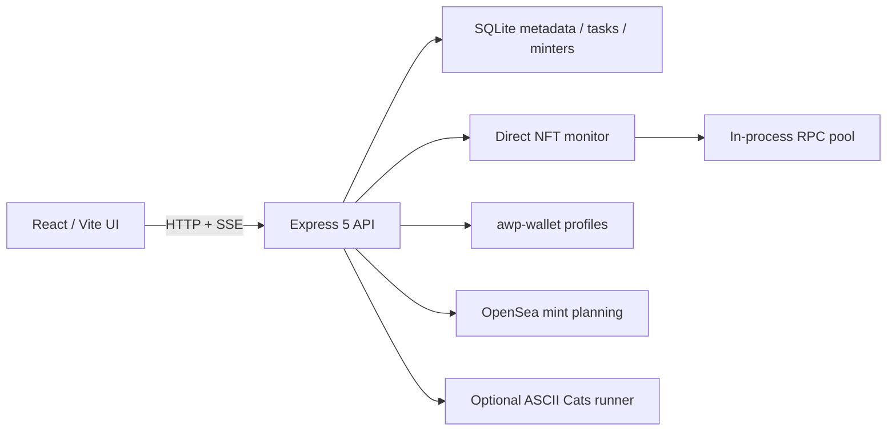

# 611nft 2.0 设计与安全说明

## 目标

611nft 2.0 将原双链 Vanilla/eRPC Mint 面板升级为 React + Express 的七链本地工作台，同时保持三个原则：真实链上数据、私钥隔离、任何资产写入必须在服务端二次确认。

## 架构

- `src/`：React 工作台、监控详情和任务状态。
- `server/index.js`：API、SQLite、AWP 子进程、Preview/Confirm 状态机。
- `server/mint-monitor.js`：链上日志扫描、供应量、Mint 价格、媒体与 lifetime minters。
- `server/rpc-pool.js`：hedging、短期缓存、inflight 合并、熔断；写方法只发一个上游。
- `ascii-cats-mint/`：固定 Robinhood ASCII Cats 流程的独立 fail-closed runner。

## 数据与信任边界

高价值资产：AWP 私钥材料、confirmation token、认证 RPC URL、远程 API token、待广播交易。

受信任：运行主机、本地 AWP profile、项目根 `.env`、显式配置的 RPC。

不受信任：浏览器请求、合集/provider 数据、RPC 响应、NFT metadata、OpenSea 交易计划、Blockscout、代理 API 和 runner ticket。

SQLite 保存钱包 profile ID/地址、标签、余额、任务、交易摘要和 minter 游标，不保存私钥或助记词。

## Mint 监控与供应量

监控器从 ERC-721/ERC-1155 的零地址 Transfer 建立活动集合，读取链上 `totalSupply()` 作为当前供应量的权威值，并尝试 `maxSupply`、`MAX_SUPPLY`、`collectionSize` 作为上限。临时读取失败时，只在已有快照上增加本批事件数量，并封顶已知最大供应量。

provider 仅作为补充；本地链上状态优先。首次无法读取供应量时显示未知，不以事件计数伪装权威总供应量。

## 资产写入协议

### NFT Mint

1. Preview 校验钱包、链、collection bytecode、provider chain、目标 bytecode、calldata、Gas、余额和值上限。
2. 服务器生成十分钟有效的一次性 token。
3. Send 使用 timing-safe 比较，立刻销毁 token。
4. 广播前重新读取 SeaDrop 公售价格、余额并执行 `eth_call`。
5. receipt 未决与 confirmed 分开表示，不把 pending 当成功。

### 通用交易

转账、归集、授权和 contract call 共用 immutable preview store。Preview 绑定操作类型、链、钱包、目标、value、calldata 和执行模式；execute 只接受 preview ID/token，不接受重新提交的交易参数。顺序任务部分成功标记为 `partial`，逐条结果可用于人工对账。

## 网络边界

默认只监听 `127.0.0.1`。配置任何非回环地址时，启动阶段强制要求至少 32 字节的 `WALLET_BOARD_API_TOKEN`；API 使用 timing-safe Bearer token 校验。Token 是应用层边界，不提供传输加密，远程使用还需 TLS、防火墙和隔离网络。

## Metadata 防护

metadata/media 解析只允许 HTTP(S)，在解析和连接前拒绝 loopback、RFC1918、link-local、ULA、multicast、保留地址及其 IPv4-mapped IPv6 表示；响应体、重定向和超时均有边界。

## 与 1.x 的兼容性变化

- Vanilla JS 与独立 eRPC 被 React/Vite 和进程内 RPC pool 替代。
- WebSocket 改为 SSE；Mint job 仍通过轮询精确收敛。
- 项目 `.env` 裸私钥被 AWP profiles 替代，旧私钥不会自动迁移。
- 支持链从 Ethereum/Robinhood 扩展到七链。
- 新增 SQLite 和资产管理操作，安全边界相应扩大。

## 变更历史

### 2026-08-14 - 合并多链 Dashboard 2.0

**变更内容**：导入 React/Vite、七链直接监控、AWP 钱包、SQLite、通用资产任务和 ASCII Cats runner；移除旧运行入口。

**变更理由**：将下载版的大规模功能更新纳入受版本管理的 611nft 主线，同时修复审查发现的远程未鉴权、客户端确认、实时详情和任务状态风险。

**影响范围**：安装、钱包迁移、前后端 API、实时协议、RPC 架构、测试、CI 和运维文档。

**决策依据**：下载包无 Git 元数据，按源码快照导入，不伪造祖先关系；旧实现保留于 Git 历史。
