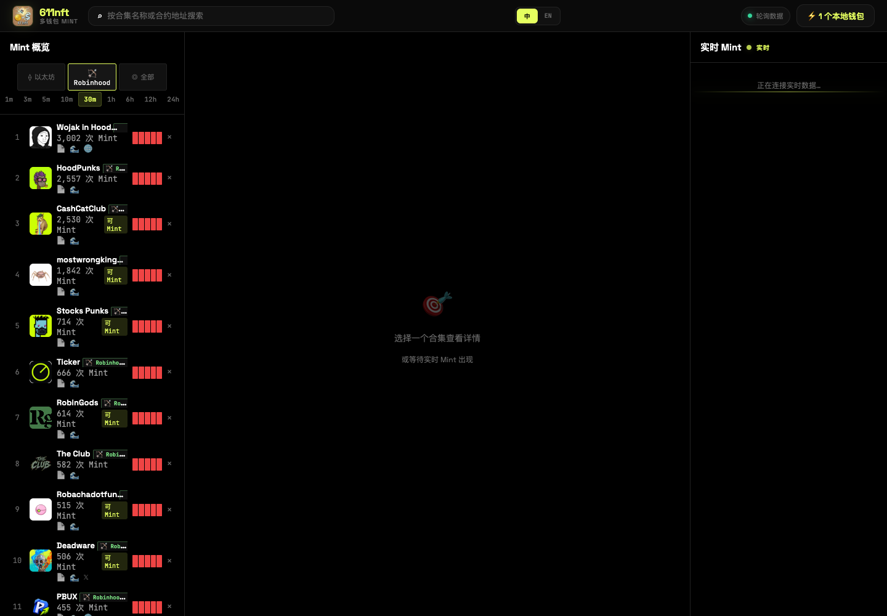
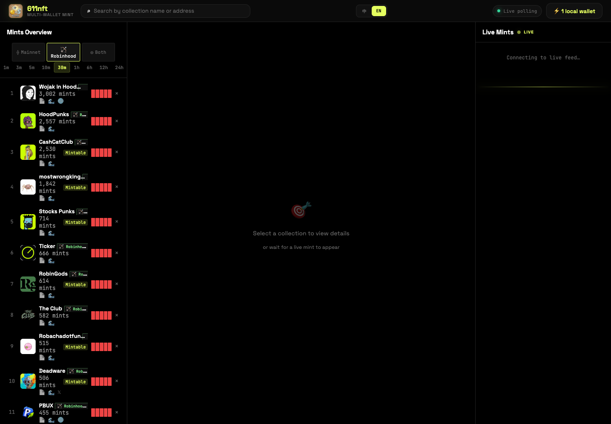
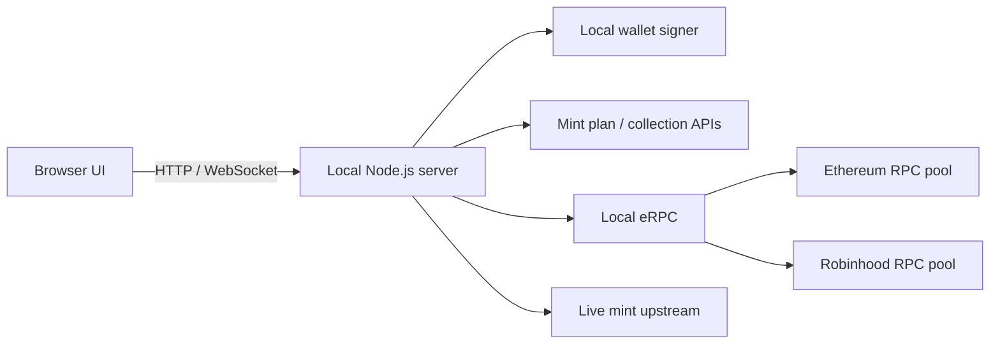

<div align="center">
  
  <h1>611nft</h1>
  <p><strong>本地优先、双语、多钱包并发的 NFT Mint 监控与执行工具</strong></p>
  <p>Local-first bilingual NFT mint monitor and multi-wallet execution console.</p>

  <p>
    <a href="#功能亮点">功能</a> ·
    <a href="#快速开始">安装</a> ·
    <a href="#配置">配置</a> ·
    <a href="#安全模型">安全</a> ·
    <a href="#english">English</a>
  </p>

  <p>
    
    
    
    
  </p>
</div>



## 项目简介

611nft 是一个运行在本机的 NFT Mint 工作台。它将实时 Mint 列表、合集详情、钱包选择、逐钱包预检、二次确认和并发广播整合在一个三栏 Web 界面中，并通过 [eRPC](https://github.com/erpc/erpc) 聚合多个 RPC 上游，缓解单节点限速和短暂故障带来的影响。

项目不依赖浏览器钱包扩展。签名钱包由本地 Node.js 进程从 `.env` 加载；浏览器只接收地址、余额和经过脱敏的交易计划。默认操作是 **Preview**，只有再次明确确认后才会签名和广播。

> [!WARNING]
> 该工具会在明确确认后签名并广播真实链上交易。链上交易不可撤销。请使用专用低余额钱包，先在测试环境验证，并逐项核对链、合约、价格、数量、Gas 与接收地址。

## 功能亮点

- **实时 Mint 监控**：链筛选、时间窗口、搜索、Mintable/Airdrop 列表和实时活动流。
- **合集详情**：供应量、Mint 价格、地板价、独立 Mint 钱包、单钱包 Mint 上限、社交链接及最近 Mint。
- **中英文切换**：静态与动态文案均支持中文/English，选择保存在浏览器中。
- **多钱包控制**：展示本地钱包地址与余额，支持逐项勾选、全选和取消全选。
- **逐钱包预检**：每个钱包独立获取交易计划，校验链、目标、calldata、余额、Gas 与费用。
- **二次确认广播**：Preview 生成短时有效的一次性 confirmation token，确认后才并发发送。
- **价格重校验**：SeaDrop `mintPublic` 在广播前重新读取价格；价格上涨时终止发送并要求重新 Preview。
- **RPC 聚合容错**：eRPC 提供多上游、超时、重试、hedging、熔断与短期缓存。
- **CLI 与 Web 双入口**：浏览器工作台和 `mint.mjs` 共用同一套核心逻辑。
- **本地优先**：默认监听 `127.0.0.1`；私钥不进入浏览器、URL、API 响应或日志。

## 界面预览

| 中文 | English |
| --- | --- |
|  |  |

钱包选择、单钱包 Mint 上限和批量 Preview 会在选中具体合集后显示。仓库截图特意不展示本地钱包地址。

## 架构



| 路径 | 作用 |
| --- | --- |
| `apps/web/` | Vanilla JS 三栏 SPA、双语字典、钱包选择与任务状态 UI |
| `server/index.mjs` | 本地 HTTP/WebSocket 服务、数据代理、Preview/Send/Job API |
| `lib/mint-core.mjs` | 钱包、交易计划、链校验、Gas/余额预检、重报价与发送 |
| `lib/wallet-config.mjs` | `.env` 逐行裸私钥解析和旧格式兼容 |
| `erpc/erpc.js` | Ethereum / Robinhood 多上游聚合配置 |
| `scripts/` | 完整栈启动、eRPC 构建/验证与 CLI 启动器 |
| `mint.mjs` | 命令行 Preview/Send 入口 |

更详细的安全边界和数据流见 [`DESIGN.md`](DESIGN.md)。

## 环境要求

- Node.js **22 或更高版本**
- npm
- Go 工具链：仅首次构建固定版本 eRPC 时需要
- macOS / Linux；Windows 建议使用 WSL
- 可访问所配置的 RPC、合集数据和 Mint 计划上游

## 快速开始

```bash
git clone https://github.com/Zerorisklabs-V1/611nft.git
cd 611nft
npm ci
cp .env.example .env
chmod 600 .env
```

编辑 `.env` 后启动完整栈：

```bash
npm run start
```

浏览器访问：

```text
http://127.0.0.1:18787
```

macOS 用户也可以双击 `一键MintScan.command`。首次启动可能需要下载并编译固定提交的 eRPC。

### 验证服务

```bash
curl http://127.0.0.1:18787/api/health
curl http://127.0.0.1:18787/api/rpc/status
```

## 配置

### 1. 钱包

推荐格式是在 `.env` 顶部 **每行直接填写一个私钥**：

```dotenv
第一钱包的64位十六进制私钥
第二钱包的64位十六进制私钥

# 下面继续写普通配置
RPC_URL=https://rpc.mainnet.chain.robinhood.com
```

规则：

- 每行恰好 64 位十六进制字符。
- 不写 `PRIVATE_KEY_1=` 等变量名。
- 不加 `0x` 前缀。
- 空行和 `#` 注释会被忽略。
- 地址不可重复。
- 旧 `PRIVATE_KEY` / `PRIVATE_KEYS` / `PRIVATE_KEY_N` 仅用于平滑升级，不要与逐行格式混用。

> [!CAUTION]
> `.env` 已被 Git 忽略。不要把私钥、助记词、钱包导出文件、Cookies 或带认证信息的 RPC URL 提交到仓库，也不要粘贴到 Issue。

### 2. RPC 与 eRPC

免费公共 RPC 可直接运行；稳定使用建议为每条链配置至少两个独立上游：

```dotenv
ETHEREUM_RPC_UPSTREAMS=https://ETH_RPC_1,https://ETH_RPC_2
ROBINHOOD_RPC_UPSTREAMS=https://HOOD_RPC_1,https://HOOD_RPC_2

ERPC_HOST=127.0.0.1
ERPC_PORT=4000
ERPC_METRICS_PORT=4001
```

不要把 `http://127.0.0.1:4000/main/evm/...` 写回上游列表，否则会形成自循环。启动器会把外部上游环境与应用使用的本地 eRPC 地址分离。

### 3. 主要环境变量

| 变量 | 默认值 | 说明 |
| --- | --- | --- |
| `HOST` | `127.0.0.1` | Web 服务监听地址 |
| `PORT` | `18787` | Web 服务端口 |
| `ERPC_HOST` | `127.0.0.1` | eRPC 监听地址 |
| `ERPC_PORT` | `4000` | eRPC HTTP 端口 |
| `ERPC_METRICS_PORT` | `4001` | eRPC Metrics 端口 |
| `ETHEREUM_RPC_UPSTREAMS` | 内置公共池 | Ethereum 上游，逗号分隔 |
| `ROBINHOOD_RPC_UPSTREAMS` | 内置公共池 | Robinhood 上游，逗号分隔 |
| `WALLET_CONCURRENCY` | `0` | `0` 表示所有合格钱包并发；正整数用于限流 |
| `GAS_LIMIT_BUFFER_BPS` | `12000` | Gas Limit 缓冲，`12000` 表示增加 20% |
| `MINT_QUANTITY` | `1` | CLI 默认 Mint 数量 |
| `MINT_TOKEN_ID` | `0` | CLI 默认 Token ID |
| `OPENSEA_GRAPHQL_URL` | 见 `.env.example` | Mint 计划 GraphQL 地址 |
| `OPENSEA_COOKIES` | 空 | 仅公开接口确实要求已有会话时配置 |
| `WAYPOINT_API_BASE` | 见 `.env.example` | 合集与概览数据上游 |
| `WAYPOINT_WS_URL` | 见 `.env.example` | 实时 Mint WebSocket 上游 |

完整模板见 [`.env.example`](.env.example)。

## 使用流程

1. 在左侧选择链和时间窗口，或搜索合集名称/合约地址。
2. 打开合集详情并核对合约、价格、供应量与单钱包上限。
3. 勾选要使用的钱包，设置数量和并发数。
4. 点击 **Preview multi-wallet mint / 预览多钱包 Mint**。
5. 检查每个钱包的目标地址、金额、Gas、余额和跳过/失败原因。
6. 只有确认计划正确后，点击 **Confirm & broadcast / 确认并广播**。
7. 在任务状态中查看逐钱包发送与确认结果。

Preview 默认 10 分钟过期。余额不足的钱包会被跳过；其它预检错误会阻止创建广播任务。

## CLI

推荐通过完整 eRPC 栈运行：

```bash
# 仅 Preview，不广播
npm run mint -- 0xNFT_CONTRACT --quantity 1 --token-id 0

# Preview 后交互确认并发送
npm run mint -- 0xNFT_CONTRACT --send
```

仅在明确需要非交互执行时使用：

```bash
npm run mint -- 0xNFT_CONTRACT --send --yes
```

## npm 命令

| 命令 | 说明 |
| --- | --- |
| `npm run start` | 启动 eRPC 与 611nft Web 服务 |
| `npm run start:app` | 只启动 Web/API 服务 |
| `npm run start:erpc` | 只启动 eRPC |
| `npm run erpc:build` | 下载、校验并构建固定版本 eRPC |
| `npm run erpc:validate` | 验证 eRPC 配置 |
| `npm run mint -- ...` | 通过 eRPC 运行 CLI Mint |
| `npm test` | 运行源码语法与 eRPC 配置检查 |

## API 概览

| Method | Path | 说明 |
| --- | --- | --- |
| `GET` | `/api/health` | 服务与钱包配置状态 |
| `GET` | `/api/rpc/status` | 两条链的 eRPC chainId、区块高度与延迟 |
| `GET` | `/api/chains` | 支持的链配置 |
| `GET` | `/api/overview/all` | Mint 概览 |
| `GET` | `/api/collection/:address` | 合集详情 |
| `GET` | `/api/wallets?chain=hood` | 本地钱包地址与余额，不返回私钥 |
| `POST` | `/api/mint/preview` | 为选中钱包创建预检计划 |
| `POST` | `/api/mint/send` | 校验 confirmation token 后广播 |
| `GET` | `/api/mint/jobs/:id` | 查询批量任务状态 |
| `WS` | `/ws/mints` | 实时 Mint 与本地任务状态 |

## 安全模型

- 服务默认只监听本机回环地址。
- 私钥只在本地 Node.js 进程内转换为 viem account。
- 浏览器和 API 不接收私钥，也不持久化签名器。
- 默认只 Preview；广播需要第二次明确确认和一次性 token。
- 每个钱包独立生成并验证交易计划，不复用其它钱包的签名上下文。
- 外部返回的链、目标地址、calldata 和价值字段在执行前校验。
- SeaDrop 公售价格在发送前重新读取，避免使用过期价格计划。
- eRPC 写方法不启用多次重试，避免重复广播。

开源不等于已经完成第三方审计。生产使用前请自行审查源码，并参考 [`SECURITY.md`](SECURITY.md) 报告问题。

## 已知限制

- 数据、WebSocket、GraphQL 和 RPC 均依赖外部服务；其 schema、限速或可用性变化会影响功能。
- 实时 WebSocket 被限速时会退化为真实 Overview 增量轮询，事件细节可能延迟补齐。
- 浏览器界面目前聚焦 Ethereum 与 Robinhood Chain。
- 项目使用本地原始私钥签名，安全边界取决于运行机器和 `.env` 文件保护。
- 链上交易不可撤销，项目不承担 Gas、资产损失或第三方数据错误造成的后果。

## 贡献

欢迎提交 Issue 和 Pull Request。开始前请阅读 [`CONTRIBUTING.md`](CONTRIBUTING.md)：

```bash
npm ci
npm test
```

提交时不要包含真实钱包、`.env`、日志、HAR、Cookies、私有 RPC 凭据或链上签名材料。

## 开源许可

本项目以 [MIT License](LICENSE) 开源。

第三方产品、协议和商标归各自所有。611nft 与所引用的数据、市场、RPC 或钱包服务不存在官方隶属或背书关系。

---

<a id="english"></a>

## English

611nft is a local-first, bilingual NFT mint monitor and multi-wallet execution console. It combines a live mint dashboard, collection details, wallet selection, per-wallet preflight checks, explicit second-step confirmation, concurrent broadcasting, and an eRPC resilience layer.

### Quick start

```bash
git clone https://github.com/Zerorisklabs-V1/611nft.git
cd 611nft
npm ci
cp .env.example .env
chmod 600 .env
npm run start
```

Open `http://127.0.0.1:18787`.

### Wallet format

Place one bare 64-character hexadecimal private key per line at the top of `.env`. Do not add a variable name and do not add the `0x` prefix. Keep RPC and application settings below as normal `KEY=VALUE` lines.

### Safety

- Keys stay in the local Node.js process and are never returned to the browser.
- Preview is the default behavior; broadcasting requires a second explicit confirmation.
- Use dedicated low-value wallets and verify every transaction plan.
- Never commit `.env`, credentials, cookies, logs, HAR files, or signed transaction material.

See the Chinese sections above for the complete configuration, workflow, API, architecture, and security documentation.
